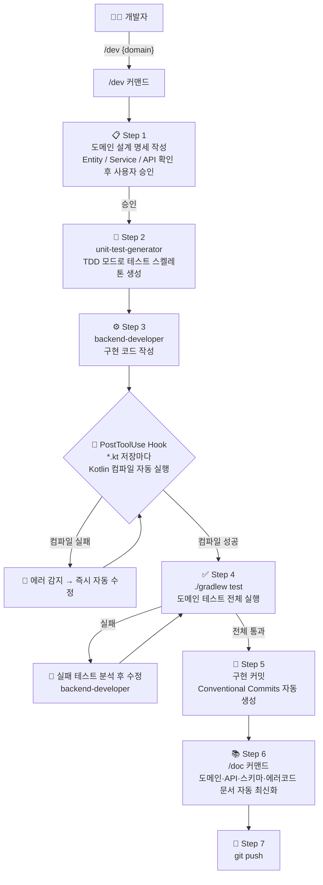

# 🛍️ Claude Code 하네스 엔지니어링 × 패션 커머스


> **Claude Code**로 하네스 엔지니어링 환경을 구성하고, 그 위에서 의류·신발 패션 자사몰을 풀스택 개발하는 실험적 프로젝트

---

## 📌 프로젝트 목적

이 프로젝트는 두 가지 목표를 동시에 추구한다.

1. **하네스 엔지니어링 실험** — Claude Code의 전문화 에이전트, 커스텀 커맨드, PostToolUse Hook을 조합해 개발 품질과 속도를 자동화하는 환경을 구축한다.
2. **커머스 도메인 개발** — 위 환경 위에서 실제 동작하는 패션 자사몰 백엔드·프론트엔드를 개발한다.

---

## 🤖 하네스 엔지니어링 구성

### 구성 요소

| 종류 | 이름 | 역할 |
|------|------|------|
| **에이전트** | `backend-developer` | Entity / Service / Repository / Controller 전 계층 구현 |
| **에이전트** | `frontend-developer` | Next.js 페이지 / 컴포넌트 / API 연동 구현 |
| **에이전트** | `unit-test-generator` | 구현 파일 분석 후 Kotest/MockK 테스트 자동 생성 (TDD Mode 지원) |
| **커맨드** | `/dev {domain}` | 설계 → TDD → 구현 → 테스트 → 커밋 → 문서화 7단계 자동 실행 |
| **커맨드** | `/doc {domain}` | git diff 분석 후 도메인·API·스키마·에러코드 문서 자동 최신화 |
| **커맨드** | `/ship` | 테스트 → 커밋 메시지 자동 생성 → 커밋 → 푸시 한 번에 처리 |
| **Hook** | PostToolUse | `.kt` 저장 시 Kotlin 컴파일, `.ts/.tsx` 저장 시 TypeScript 타입 체크 자동 실행 |
| **MCP** | `plan-review` | 구현 전 설계 계획 검토 |

### 워크플로우 (`/dev` 커맨드 기준)



---

## 🛠️ 기술 스택

| 구분 | 기술 |
|------|------|
| **백엔드** | Kotlin 2.2.21 / Spring Boot 4.0.5 / Spring Data JPA / Spring Security + JWT |
| **데이터베이스** | PostgreSQL 16 |
| **프론트엔드** | Next.js 16 (App Router) / TypeScript 5 / TanStack Query 5 / Zustand 5 / Tailwind CSS 4 |
| **AI 도구** | Claude Code (claude-sonnet-4-6) |
| **하네스** | 전문화 에이전트 3종 / 커스텀 커맨드 3종 / PostToolUse Hook / MCP plan-review |
| **성능 테스트** | k6 |

---

## ✅ 구현된 도메인

| 도메인 | 상태 | 핵심 기술 포인트 |
|--------|------|----------------|
| `user` | ✅ 완료 | Spring Security + JWT 인증, BCrypt 비밀번호 해싱 |
| `category` | ✅ 완료 | 2depth 계층 구조 (대분류 / 소분류) |
| `product` | ✅ 완료 | ProductOption 단위 재고 관리, Pessimistic Lock |
| `cart` | ✅ 완료 | 재고 확인 후 CartItem CRUD |
| `order` | ✅ 완료 | OrderItem 스냅샷, 상태 전이, 10분 만료 스케줄러 |
| `payment` | ✅ 완료 | Mock PG 연동, 실패 시 재고·포인트 자동 복원 |
| `review` | ✅ 완료 | OrderItem 단위 리뷰, 0.5 단위 별점, N+1 배치 쿼리 |
| `like` | ✅ 완료 | 좋아요 토글, 복수 상품 상태 배치 조회 |
| `coupon` | ✅ 완료 | 정액/정률 쿠폰, Optimistic Lock 동시 발급 제어 |
| `point` | ✅ 완료 | 리뷰·구매 적립, 결제 사용, Optimistic Lock |
| `settlement` | ✅ 완료 | 일별 매출 집계 스케줄러, PENDING → CONFIRMED → PAID |

---

## 📈 성능 목표 (SLO)

| 지표 | 목표 |
|------|------|
| DAU | 10,000명 |
| 피크 동시 접속 | ~1,000명 |
| 피크 RPS | ~100 req/s |
| API 응답시간 | P95 < 200ms |
| 가용성 | 99.9% (월 다운타임 < 43분) |
| 에러율 | < 0.1% |

---

## 🗂️ 프로젝트 구조

```
commerce/
├── apps/
│   ├── api/                    # Spring Boot 백엔드
│   │   └── src/main/kotlin/com/example/commerce/
│   │       ├── {domain}/       # 도메인별 entity / repository / service / controller / dto
│   │       └── common/         # BaseEntity / ApiResponse / ErrorCode / CustomException
│   └── web/                    # Next.js 16 프론트엔드
│       └── src/app/            # App Router 페이지 및 컴포넌트
├── docs/
│   ├── architecture/           # 시스템 아키텍처, JWT 보안 설계
│   ├── api/                    # API 공통 규칙, 전체 엔드포인트 목록
│   ├── database/               # 엔티티 스키마, 관계도
│   ├── domain/                 # 도메인별 비즈니스 규칙 및 유스케이스
│   ├── development/            # 로컬 세팅, 코드 컨벤션, 에러 코드 목록
│   └── troubleshooting/        # 개발 중 발생한 문제 상황 및 해결 과정
├── tools/
│   ├── k6/                     # 성능 테스트 시나리오 스크립트
│   └── plan-review/            # MCP 서버 (설계 계획 검토)
└── .claude/
    ├── agents/                 # 전문화 에이전트 정의 (backend / frontend / test)
    ├── commands/               # 커스텀 슬래시 커맨드 (dev / doc / ship)
    └── settings.json           # PostToolUse Hook, 권한 설정
```

---

## 🚀 실행 방법

### 사전 요구사항

- JDK 21+
- Node.js 20+
- PostgreSQL 16+

### 데이터베이스 설정

```sql
CREATE DATABASE commerce;
CREATE USER commerce WITH PASSWORD 'commerce1234';
GRANT ALL PRIVILEGES ON DATABASE commerce TO commerce;
```

### 환경변수 (선택)

| 변수 | 기본값 | 설명 |
|------|--------|------|
| `JWT_SECRET` | `commerce-secret-key-must-be-at-least-32-characters-long` | JWT 서명 키 (운영 시 반드시 변경) |
| `JWT_EXPIRATION_MS` | `86400000` | JWT 만료 시간 (ms), 기본 24시간 |

### 백엔드 실행

```bash
./gradlew bootRun
# API 서버: http://localhost:8080
# Swagger UI: http://localhost:8080/swagger-ui.html
```

### 프론트엔드 실행

```bash
cd apps/web
npm install
npm run dev
# 개발 서버: http://localhost:3000
```

### OpenAPI 타입 생성 (백엔드 기동 상태에서)

```bash
npm run generate:types
```

---

## 📚 문서 구조

| 경로 | 내용 |
|------|------|
| `docs/architecture/` | 시스템 개요, 레이어 아키텍처, JWT 보안 설계 |
| `docs/api/` | API 공통 규칙, 전체 엔드포인트 목록 (Swagger 보조용) |
| `docs/database/` | 엔티티 필드 정의, 테이블 관계도 |
| `docs/domain/` | 도메인별 비즈니스 규칙 및 유스케이스 상세 |
| `docs/development/` | 로컬 세팅 가이드, 코드 컨벤션, 에러 코드 목록 |
| `docs/troubleshooting/` | 개발 중 발생한 문제와 해결 과정 기록 |

각 도메인 폴더(`apps/api/src/main/kotlin/.../domain/CLAUDE.md`)에는 해당 도메인의 Entity 구조, 비즈니스 규칙, API 엔드포인트를 정리한 도메인 특화 문서가 있다.

---

## 🗺️ 로드맵

### 백엔드
- [x] 핵심 커머스 도메인 11종 구현
- [x] 일별 정산 도메인
- [ ] Redis 캐싱 (상품 목록·상세 조회)
- [ ] 검색 고도화 (Elasticsearch 또는 Full-text Search)
- [ ] CI/CD 파이프라인 (GitHub Actions)
- [ ] 운영 환경 분리 (`ddl-auto: validate`, 환경별 설정)

### 프론트엔드
- [x] 프로젝트 초기 설정 (Next.js 16 + TanStack Query + Zustand)
- [ ] 상품 목록·상세 페이지
- [ ] 장바구니·주문·결제 플로우
- [ ] 마이페이지 (주문 내역, 리뷰, 포인트, 쿠폰)
- [ ] 관리자 페이지 (상품·쿠폰·정산 관리)

### 하네스 엔지니어링
- [x] 전문화 에이전트 3종
- [x] 커스텀 커맨드 `/dev`, `/doc`, `/ship`
- [x] PostToolUse Hook (컴파일 자동 검사)
- [ ] 프론트엔드 `/dev` 커맨드 통합
- [ ] 성능 회귀 자동 감지 (k6 + Hook 연동)

---

## 📄 라이선스

[MIT License](LICENSE)
